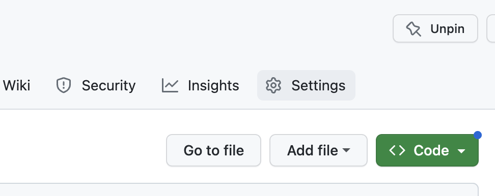
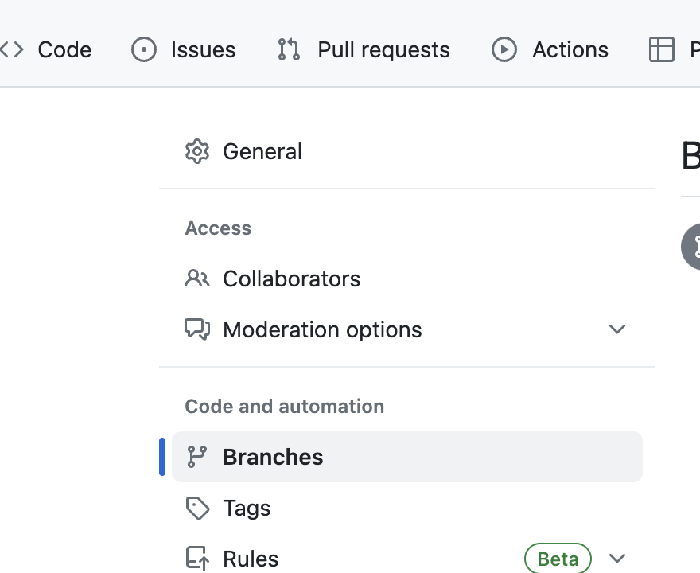
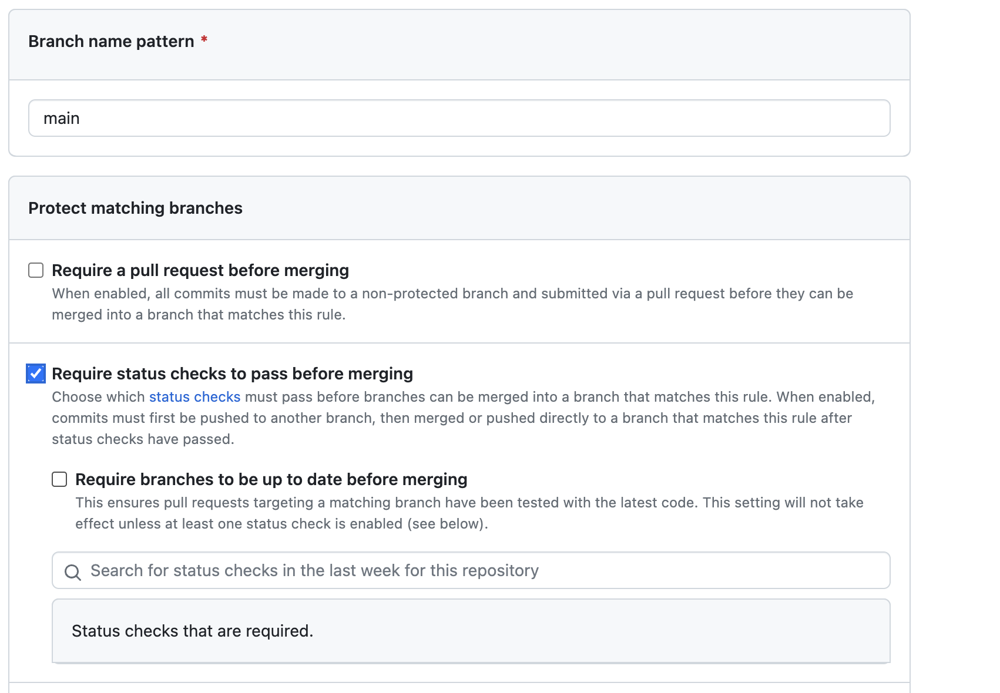

# Github Action - PR할 때마다 테스트 실행


Github Action을 이용하여 Pull Reuqest를 할 때마다 테스트를 실행시키는 방법


* [Github Action이란?](github-action-pr.md#github-action)
* [코드 샘플](github-action-pr.md#undefined)
* [Workflow 구성요소?](github-action-pr.md#workflow)
* [Test실패 시 Merge 막는 방법?](github-action-pr.md#test-merge)


## Github Action이란?

리포지토리에서 바로 소프트웨어 개발 워크플로를 자동화, 사용자 지정 및 실행할 수 있도록 도와주는 도구


## 코드 샘플

```yaml
name: Test

on: [pull_request]

jobs:
  build:
    runs-on: ubuntu-latest

    strategy:
      matrix:
        node-version: [14.x, 16.x, 18.x]

    steps:
      - uses: actions/checkout@v2
      - name: Use Node.js ${{ matrix.node-version }}
        uses: actions/setup-node@v2
        with:
          node-version: ${{ matrix.node-version }}
          cache: 'npm'
      - name: Test
        run: npm run test:all
```


## Workflow 구성요소?

* `name`: workflow 이름(생략 시 경로를 이름으로 설정)
* `on`: workflow의 트리거 명시(여기서는 pull\_request 발생 시 동작)
* `jobs`: 하나 이상의 job으로 구성(job 그룹)
  * `build`: job의 이름(여기서는 build)
  * `runs-on`: 동작시킬 운영체제
  * `strategy`: 여러 OS 환경이나 언어 버전을 사용하여 테스트할 때 이용
    * `matrix`: 조합할 선지 정의
  * `steps`: step 그룹
    * `uses`: action을 사용할 때 경로 혹은 action 이름 명시
    * `name`: step 이름
    * `with`: action에 넘겨줄 파라미터
    * `run`: bash에서 실행할 명령어를 정의(`working-directory`와 함께 사용되어 해당 경로에서 실행시키기도 함)


## \* Test 실패 시 Merge 막는 방법?

1. 리포지토리 상단 탭에서 Setting



2. 사이드바에서 Branches



3. Add Branch Protecdted Rule 또는 Add Rule 클릭
4. 원하는 브랜치명과 Require status checks to pass before merging 옵션을 선택 & Search input에 해당 job을 검색하여 등록하면 최종 완료




## 출처

* [https://docs.github.com/ko/actions](https://docs.github.com/ko/actions)
