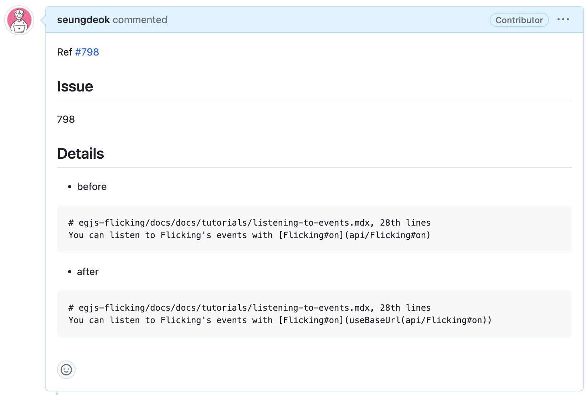

# \[회고] Opensource 첫 번째 기여


회고는 프로젝트 단위로 진행되며 [KPT 방법](https://code-artisan.io/retrospective-method-kpt/)으로 진행됩니다.


## 프로젝트 링크.

[https://github.com/naver/egjs-flicking](https://github.com/naver/egjs-flicking)

## 프로젝트를 시작하며.

오픈소스 기여로 시작한 것은 아니었다.

오픈 소스를 보며 코드의 작성과 프로젝트의 관리에 대해 배우고 싶은 마음이 컸다.

Javascript 관련 오픈소스들을 찾아보며 README를 읽어보다 우연히 404가 뜨는 페이지를 발견했다.

사실 이슈로만 남길까 고민도 했지만, 단순 Route 연결 문제여서 쉽게 해결할 수 있는 이슈였다.

오픈소스에 기여해보고 싶은 두근거림에 이슈로 남겼다.

<figure><figcaption>
issue
</figcaption></figure>

Fork하여 해당 부분 URL을 수정해준 다음 PR을 한 번 올려보았다.

(+ CONTRIBUTING 관련 문서를 몇 회독을 했는지 모른다..)

<figure><figcaption>
pull request
</figcaption></figure>

비록 한 줄 이지만,,,

오픈소스에 기여한다는 마음에 뿌듯했다.

<figure><figcaption></figcaption></figure>

관리가 잘되고 있는 오픈소스라 그런지 1시간도 안되서 답변이 오셨고 PR에 대한 리뷰를 받을 수 있었다.

기존 코드 스타일을 내가 다 파악하지 못해 해당 부분 리뷰를 해주셨고 그 부분을 수정하여 commit했다.

다시 커밋한 부분에 대해 리뷰어분들의 확인 후 무사히 PR이 merge되며 기여를 마쳤다.

## KPT.

### Keep.

* 오픈소스를 꾸준히 읽으며 오픈소스를 운영하는 역량도 간접적으로 배우고 기여할 수 있는 부분은 기여해볼 것 이다.

### Problem.

* 오픈소스 운영을 위해 필요한 세팅들과 파일들이 많고 특정 프로젝트를 이해하기에 많은 시간이 소요됩니다.

### Try.

* 내가 자주 사용하는 라이브러리 혹은 프레임워크부터 시작해본다면 갭이 줄어들 것 같습니다.
* 오픈소스 운영을 위해 세팅들이 있는데 토이 프로젝트를 통해 나만의 패키지를 만들어보는 방법이 있을 것 같습니다.

## 프로젝트를 마치며.

인적으로 토이프로젝트로 예전에 npmjs.com에 올리고 opensource로 잠시 방치했던 경험이 있는데

매주 다운로드 수가 올라서 신기하게 느꼈던 경험이 있었다.&#x20;

당시에는 올리는 것에 목표를 두고 운영할 역량이 부족하여

해당 라이브러리를 받으신 분들은 대단히 좋지 않은 개발자 경험을 드렸을 것 같아 죄송한 마음도 든다.

회사에서는 하루에 수십번도 commit을 하지만

오픈소스라고 하면 괜히 내가 그동안 거리를 뒀었던 것 같다.

내가 오픈소스에 기여한다는 것이 개발 생태계에 기여하는 것 같아 개발자로의 보람이 느껴지는 작업인 것 같고

리뷰와 다른 사람들의 코드를 읽으며 기술적으로도 성장할 수 있을 것 같다.

이번 일을 계기로 꼭 commit을 통한 기여가 아니더라도 꾸준히 오픈소스를 읽어보기로 마음을 먹었다.
