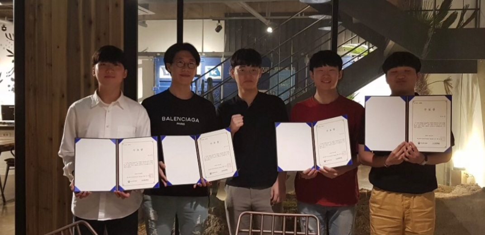

# 👫 SAGKorea 대구 경북 개발자 커뮤니티

대학교 복학과 동시에 개발자 교육을 신청하고

처음으로 접해보는 내용들과 방대한 양에  매주 따라가기 바쁜 스프린트를 이어갔다.

세션 동안 SNS와 컴퓨터에 남아있는 파일들 정리하며 9주 동안의 커뮤니티 활동 경험을 회고해 보고자 한다.

## 지원하며.

<figure><figcaption></figcaption></figure>

복학을 하면서 대학 커뮤니티에 우연히 학교생활과 병행이 가능한 개발자 교육 프로그램 공고를 발견했다.\
\
복무중에 개발에 대해서 우연히 알게되어 솔루션(앱 인벤터, 스마트 메이커)을 활용하여 앱과 매크로 코드를 짜면서 실무에서는 어떻게 진행되는지가 궁금했다.\
\
실제로 어떻게 만들어지는 지도 알 수 있고, 같은 관심사를 가진 분들도 뵐 수 있을 것 같아 자기소개서를 작성했고 2주정도 지나 잊어버릴 때쯤 합격의 메일을 받았다!!

<figure><figcaption></figcaption></figure>

## 어떤 교육?

기업 인턴을 처음 시작한 곳은 대구 북구 소재의 AILTOS 라는 곳이었다.

개발자 교육을 운영하고 SI 프로젝트를 수행하는 스타트업이었다.

교육 프로그램은 개발 경험이 있는 반과 비전공자반으로 나뉘었는데,

내가 자기소개서에 복무 중 개발한 앱에 대한 이야기를 써서 경험이 있는 반으로 배정이 되었다.(이 부분이 큰 실수였다..)

간단히 OT를 통해 교육 방향과 강사 소개를 해주시고 Javascript 기반의 웹 / 서버 / 앱 개발 세션을 진행하셨다.

(+ 중간에 SAGKOREA 대표님께서 비즈니스에 대한 특별 세션도 진행해주셨다.)

## 교육 시작.

기본적으로는 Javascript를 활용한 웹 / 서버 만드는 방법에 대한 세션을 진행하고

최신 기술인 React.js에 대해서도 세션을 진행해주셨다.

(+ 나는 앱 만드는 법도 알고 싶었는데 해커톤 전주에 React Native를 활용한 앱 세션도 1차례 진행해주셨다.)

## 배운 것?

실제 개발자분들은 어떻게 소통을 하는지 배웠다.

프로젝트에는 기한이라는 게 있는데 시간관리와 협업하는 방법을 옆에서 간접적으로 볼 수 있는 기회였다.

여러가지 툴의 사용 법과 라이브러리 적용을 할 때 우선순위와 함께 공식문서의 중요성에 대해서도 배웠다.

마지막으로 실무에서 쓰는 코드를 일부 보여주시면서 남이 읽기 좋은 코드에 대해서도 알려주셨는데,

가슴이 뛰기도하면서도 한 편으로는 어느정도로 공부해야할지 감이 오지도 않는 시간이었다.

## 잘된 것?

나는 "끝까지 살아남는 사람은 성장하게 된다고 믿는 사람"이라 믿는다.

따라 가기 벅찬 시간이었지만 수료까지 버텨낸 스스로에게 의미있는 시간이었다.

퀄리티를 떠나 밤잠 설쳐가며 서비스를 완성해서 배포까지 이뤄낸 부분에 대해서 스스로에게 대견한 마음이 든다.

## 아쉬운 것?

비록 해커톤에서 원하는 기능 모두를 구현하지는 못한 부분과 함께

구현에 초점을 맞추다보니 코드 퀄리티와 충분한 테스트를 하지 못한 부분이 아쉽지만

첫 술에 이 정도면 만족스러운 한 술이었다고, 다음 Task를 만든 것이라고 생각한다.

## Next Step?

해커톤 프로젝트 발표 이후 바로 수료식이 진행되었다.

처음 인사를 나누고 어색하게 앉아있던 시간이 엊그제 같은데 벌써 수료라니..

개발이라는 것을 알기엔 9주라는 시간이 너무나도 짧다.

개발에 관심만 있던 내가 협업과 소통, 개발 역량을 이렇게 까지 늘릴 수 있었던 것은

교육 덕분이기도 하지만 그만큼 나도 따라가기 위해 치열하게 시간을 보낸 것 같다.

이제는 다시 현실로 돌아갈시간이다.

개발자는 어떤 일을 하는지 이제 조금 알았을 뿐 지금부터 진짜 시작이라고 생각한다.

내가 맡은 것에 대해서는 책임감 있고 함께 일하고 싶은 개발자가 되고싶다.

<figure><figcaption></figcaption></figure>

##
