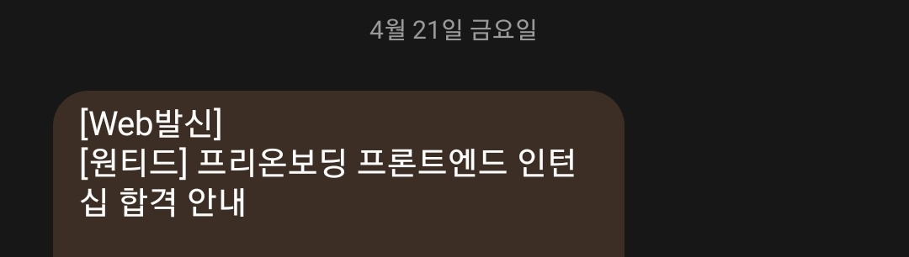

# \[회고] 사전과제


회고는 프로젝트 단위로 진행되며 [KPT 방법](https://code-artisan.io/retrospective-method-kpt/)으로 진행됩니다.


## 프로젝트 링크.



## 프로젝트를 시작하며.

새로운 기술을 배우게 될 때 가장 쉽게 접할 수 있는 토이 프로젝트가 Todo App인 것 같다.

사전 과제로 Todo App이 나왔을 때 익숙하면서도 기본 라이브러리 없이 작성해야하는 부분이 허들이 되었던 것 같다.

그동안 여러 라이브러리에 많이 의지했을지도 모른다는 생각이 들면서 기본으로 돌아가기로 했다.

## KPT.

### Keep.

* React 내장 함수 중 memo, useCallback을 사용하여 렌더링 최적화를 효율적으로 할 수 있었다.
* 클라이언트단 API Helper를 만들어 효율적으로 관리/사용할 수 있었다.
* 프로젝트의 README.md를 템플릿으로 다른 프로젝트에서도 유연하게 사용할 수 있을 것 같다.

### Problem.

* 디자이너와 일을 하거나 UI kit에 익숙해졌었던 탓인지 익숙함에 속아 스스로 디자인하는게 생각보다 리소스가 많이 들었다.
* 배포를 제외한 CI/CD 작업을 추가적으로 하지 못했다.

### Try.

* UI kit없이도 디자인할 수 있도록 디자인 Kit를 만들어놓거나 공부를 할 필요가 있다.
* CI/CD를 위한 Boilerplate를 만들어놓을 필요가 있다.

## 프로젝트를 마치며.

합격의 기대보다는 스스로를 객관적으로 판단할 수 있어서 좋았다.

(+ 제로베이스에서 코드를 짜보기를 잘했다.)

합격 여부와 관련 없이 결과가 나오면 내가 부족한 부분들을 리팩토링 해 볼 생각이다.

## Next Step.

일주일도 채 되지 않는 시간동안 안다고 생각했던 것에 대해 다시 공부해야할 방향에 대해 가이드를 잡았다.

결과가 나올 때까지는 해당 키워드를 중심으로 다시 돌아보고 리팩토링 회고를 다시 써볼 생각이다.

(+추가 후기)

2주정도 텀이 있었고 발표날 오전까지도 연락이 없어 떨어진 줄 알았으나(+기대가 없었지만,, 씁쓸함은 있었나보다)

점심을 먹고 오니 합격 문자가 날아와있었다.

<figure><figcaption></figcaption></figure>

첫 단추라고 생각하고 이런 성과가 모여 큰 시너지를 낼 것이라고 생각한다.

인턴십이라는 시간이 의미있는 시간이 되도록 준비해 볼 생각이다.
