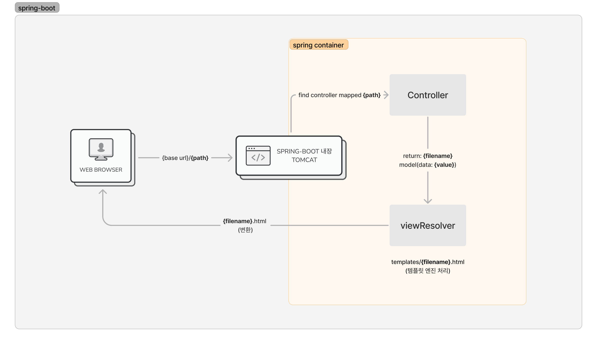

# 💡 Template Engine

### 공식 지원하는 엔진

* [FreeMarker](https://freemarker.apache.org/docs/)
* [Groovy](https://docs.groovy-lang.org/docs/next/html/documentation/template-engines.html#\_the\_markuptemplateengine)
* [Thymeleaf](https://www.thymeleaf.org/)
* [Mustache](https://mustache.github.io/)

### 동작방식

<figure><figcaption></figcaption></figure>

### 출처

* [https://docs.spring.io/spring-boot/docs/2.3.1.RELEASE/reference/html/spring-boot-features.html#boot-features-spring-mvc-template-engines](https://docs.spring.io/spring-boot/docs/2.3.1.RELEASE/reference/html/spring-boot-features.html#boot-features-spring-mvc-template-engines)
