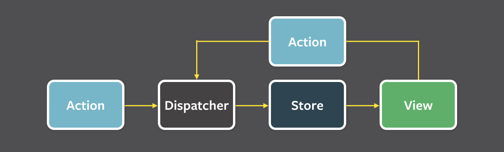

# 4월14일

### 디자인패턴

> 프로그램 설계시 발생하는 문제점을 해결할 수 있도록 만들어놓은 패턴

#### 패턴

3. Flux 패턴

* MVC 모델의 단점(양방향 데이터 흐름)을 보안하기 위해 페이스북에서 발표한 아키텍처
* 단방향(Dispatcher -> Store -> View) 데이터 흐름으로 어플리케이션을 예측 가능하도록 구현

<figure><figcaption></figcaption></figure>

Dispatcher

* Dispatcher는 전체 애플리케이션에서 한 개의 인스턴스만 사용
* Store의 데이터를 조작하는 것은 오직 Dispatcher를 통해서만 가능
* Action 발생하면 Dispatcher는 전달된 Action 확인하여 등록된 콜백함수 실행하여 Store로 전달

Store(Model)

* 상태 저장소 = 모든 상태 변경 결정
* Dispatcher 수신 위해서는 Dispatcher에 등록된 콜백 함수 등록
* Store 변경되면 View에 알림

View

* 사용자가 View에 어떤한 조작을 하면 그에 해당하는 Action을 생성
* 자식 View로 데이터 내려주는 View Controller 역할 -> 데이터 변경되면 화면 리렌더링

Action

* 데이터를 변경하는 행위로서 Dispatcher에게 전달되는 객체
* Action creator 메서드는 새로 발생한 Action의 타입과 새로운 데이터를 묶어 Dispatcher에게 전달되는 객체 리턴
