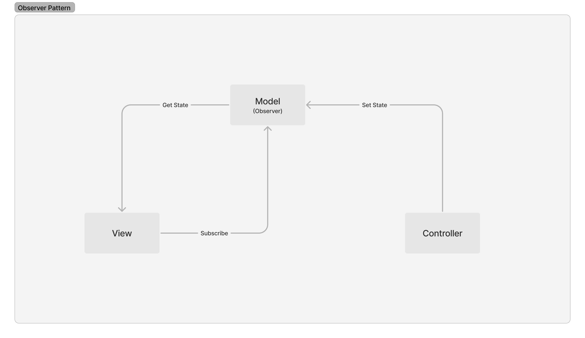

# 4월 15일

### 디자인패턴

> 프로그램 설계 시 발생하는 문제점을 해결할 수 있도록 만들어놓은 패턴

#### 패턴

4. 전략 패턴(Strategy Pattern, Policy Pattern)

* 특정 _컨텍스트_(_Context_)에서 알고리즘, 전략(Strategy)을 별도로 분리하여 선택할 수 있도록 하는 설계
* 예시) 결제, 인증


```javascript
// LocalStrategy
passport.use(new LocalStrategy(
  function(username, password, done) {
    User.findOne({ username: username }, function (err, user) {
      if (err) { return done(err); }
      if (!user) { return done(null, false); }
      if (!user.verifyPassword(password)) { return done(null, false); }
      return done(null, user);
    });
  }
));


// OAuth Strategy(예시: Google OAuth2)
passport.use(new GoogleStrategy({
    clientID:     GOOGLE_CLIENT_ID,
    clientSecret: GOOGLE_CLIENT_SECRET,
    callbackURL: "http://yourdomain:3000/auth/google/callback",
    passReqToCallback   : true
  },
  function(request, accessToken, refreshToken, profile, done) {
    User.findOrCreate({ googleId: profile.id }, function (err, user) {
      return done(err, user);
    });
  }
));
```



5. 옵저버 패턴

* 주체(관찰자)가 어떤 객체(Subject)의 상태변화를 관찰하여 옵저버에게 알려주는 패턴
* 예시) 이벤트 기반 시스템

<figure><figcaption></figcaption></figure>


### 출처

* [https://www.passportjs.org/packages/](https://www.passportjs.org/packages/)

