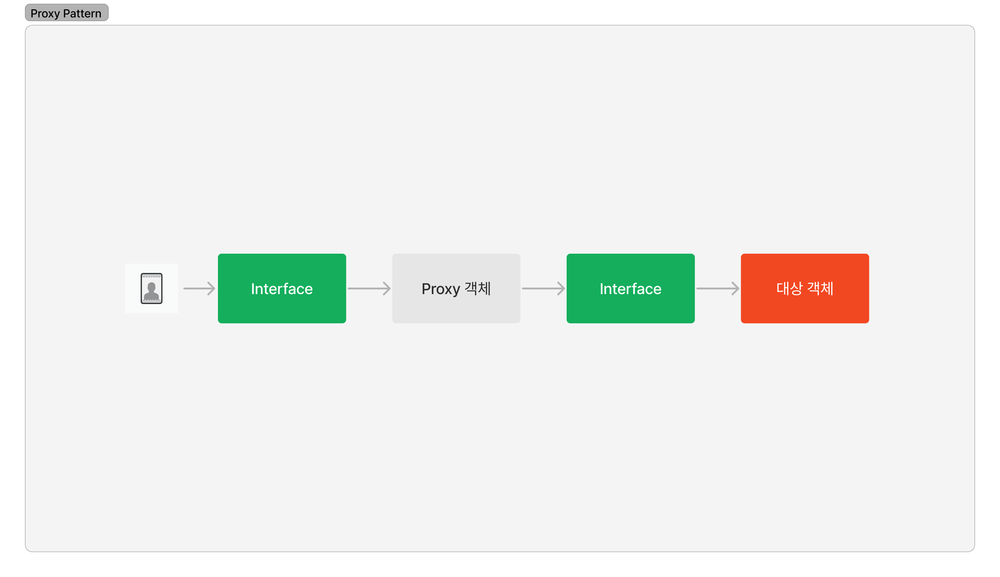

# 4월16일

### 디자인패턴

> 프로그램 설계 시 발생하는 문제점을 해결할 수 있도록 만들어놓은 패턴

#### 패턴

6. 프록시 패턴

* 대상 객체에 접근하기 전 가로채 앞단의 인터페이스 역할을 하는 패턴

<figure><figcaption></figcaption></figure>

#### 프록시 서버

> 서버와 클라이언트 사이에 클라이언트가 간접적으로 다른 네트워크 서비스에 접속할 수 있도록 해주는 응용프로그램

<figure><figcaption></figcaption></figure>

* nginx: 실제 포트 보안, 정적 자원 gzip 압축, 로깅
* CloudFlare: DDOS 방어, HTTPS 구축, CHPTCHA로 외부 트래픽 보호
