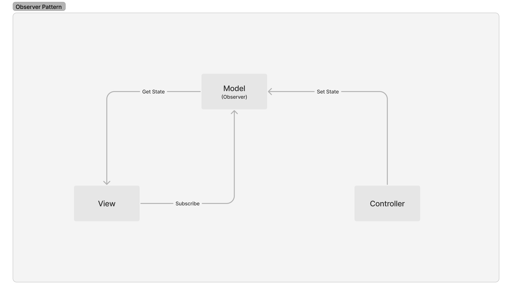

# 4월2주차

### 디자인패턴

> 프로그램 설계 시 발생하는 문제점을 해결할 수 있도록 만들어놓은 패턴

#### 패턴

1. 싱글톤 패턴

* 1개의 Class에 1개의 인스턴스만


```javascript

class Singleton {
    constructor() {
        if (!Singleton.instance) {
            Singleton.instance = this
        }
        return Singleton.instance
    }
    getInstance() {
        return this.instance
    }
}
const a = new Singleton()
const b = new Singleton()
console.log(a === b) // true
```


* 미리 생성된 하나의 인스턴스 기반으로 구현\
  \-> 인스턴스 생성 비용이 감소\
  \-> TDD 단위 테스트에서 독립적인 인스턴스 생성 까다로움
* 의존성이 높아짐 \
  \-> 모듈 간의 결합이 강해짐 (solution) 의존성주입(DI, Dependency Injection) 필요
* 주로 DB 연결 모듈에서 구현 ex) mongoose, mysql



```javascript
// define instance
Mongoose.prototype.connect = function(uri, options, callback) {
    const _mongoose = this instanceof Mongoose ? this : mongoose;
    const conn = _mongoose.connection;
    
    return _monoose._promiseOrCallback(callback, cb => {
        conn.openUri(uri, options, err => {
            if (err != null) {
                return cb(err);
            }
            return cb(null, _mongoose);
        });
    });
};
```




```javascript
// define instance
const mysql = require("mysql");
const pool = mysql.createPool({
    connectionLimit: 10,
    host: 'example.com',
    user: 'user',
    password: 'usersecret',
    database: 'dbname'
});

pool.connect();

// define module using instance
pool.query(querystring, function(error, results, fields) {
    if (error) throw error;
    console.log(results[0].solution);
});
```



2. 팩토리패턴

* 상위 class가 중요한 뼈대, 하위 class에서 **객체 생성**에 관한 구체적 내용
* 전달 받은 값에 따라 다른 객체 생성하고 인스턴스 타입 정의

```javascript
class Wood {
    constructor() {
        this.name = "wood"
    }
}

class Aluminum {
    constructor() {
        this.name = "aluminum"
    }
}

class WoodFactory {
    static createBat() {
        return new Wood()
    }
}

class AluminumFactory {
    static createBat() {
        return new Aluminum()
    }
}

const factoryList = { WoodFactory, AluminumFactory }

class BatFactory {
    static createBat(type) {
        const factory = factoryList[type]
        return factory.createBat()
    }
}

const main = () => {
    const bat = BatFactory.createBat("WoodFactory")
    console.log(bat.name)
}
```

* WoodFactory에서 생성한 인스턴스를 BatFactory에 주입 = DI
* 정적 메서드 선언(static)
  * 객체를 만들지 않고 호출가능.
  * 해당 메서드 메모리 할당을 1번만 할 수 있음.


3. Flux 패턴

* MVC 모델의 단점(양방향 데이터 흐름)을 보안하기 위해 페이스북에서 발표한 아키텍처
* 단방향(Dispatcher -> Store -> View) 데이터 흐름으로 어플리케이션을 예측 가능하도록 구현

<figure><figcaption></figcaption></figure>


Dispatcher

* Dispatcher는 전체 애플리케이션에서 한 개의 인스턴스만 사용
* Store의 데이터를 조작하는 것은 오직 Dispatcher를 통해서만 가능
* Action 발생하면 Dispatcher는 전달된 Action 확인하여 등록된 콜백함수 실행하여 Store로 전달


Store(Model)

* 상태 저장소 = 모든 상태 변경 결정
* Dispatcher 수신 위해서는 Dispatcher에 등록된 콜백 함수 등록
* Store 변경되면 View에 알림


View

* 사용자가 View에 어떤한 조작을 하면 그에 해당하는 Action을 생성
* 자식 View로 데이터 내려주는 View Controller 역할 -> 데이터 변경되면 화면 리렌더링


Action

* 데이터를 변경하는 행위로서 Dispatcher에게 전달되는 객체
* Action creator 메서드는 새로 발생한 Action의 타입과 새로운 데이터를 묶어 Dispatcher에게 전달되는 객체 리턴


4. 전략 패턴(Strategy Pattern, Policy Pattern)

* 특정 _컨텍스트_(_Context_)에서 알고리즘, 전략(Strategy)을 별도로 분리하여 선택할 수 있도록 하는 설계
* 예시) 결제, 인증


```javascript
// LocalStrategy
passport.use(new LocalStrategy(
  function(username, password, done) {
    User.findOne({ username: username }, function (err, user) {
      if (err) { return done(err); }
      if (!user) { return done(null, false); }
      if (!user.verifyPassword(password)) { return done(null, false); }
      return done(null, user);
    });
  }
));


// OAuth Strategy(예시: Google OAuth2)
passport.use(new GoogleStrategy({
    clientID:     GOOGLE_CLIENT_ID,
    clientSecret: GOOGLE_CLIENT_SECRET,
    callbackURL: "http://yourdomain:3000/auth/google/callback",
    passReqToCallback   : true
  },
  function(request, accessToken, refreshToken, profile, done) {
    User.findOrCreate({ googleId: profile.id }, function (err, user) {
      return done(err, user);
    });
  }
));
```



5. 옵저버 패턴

* 주체(관찰자)가 어떤 객체(Subject)의 상태변화를 관찰하여 옵저버에게 알려주는 패턴
* 예시) 이벤트 기반 시스템

<figure><figcaption></figcaption></figure>


6. 프록시 패턴

* 대상 객체에 접근하기 전 가로채 앞단의 인터페이스 역할을 하는 패턴

<figure><figcaption></figcaption></figure>


#### 프록시 서버

> 서버와 클라이언트 사이에 클라이언트가 간접적으로 다른 네트워크 서비스에 접속할 수 있도록 해주는 응용프로그램

<figure><figcaption></figcaption></figure>

* nginx: 실제 포트 보안, 정적 자원 gzip 압축, 로깅
* CloudFlare: DDOS 방어, HTTPS 구축, CHPTCHA로 외부 트래픽 보호


### 출처

* [https://www.passportjs.org/packages/](https://www.passportjs.org/packages/)

