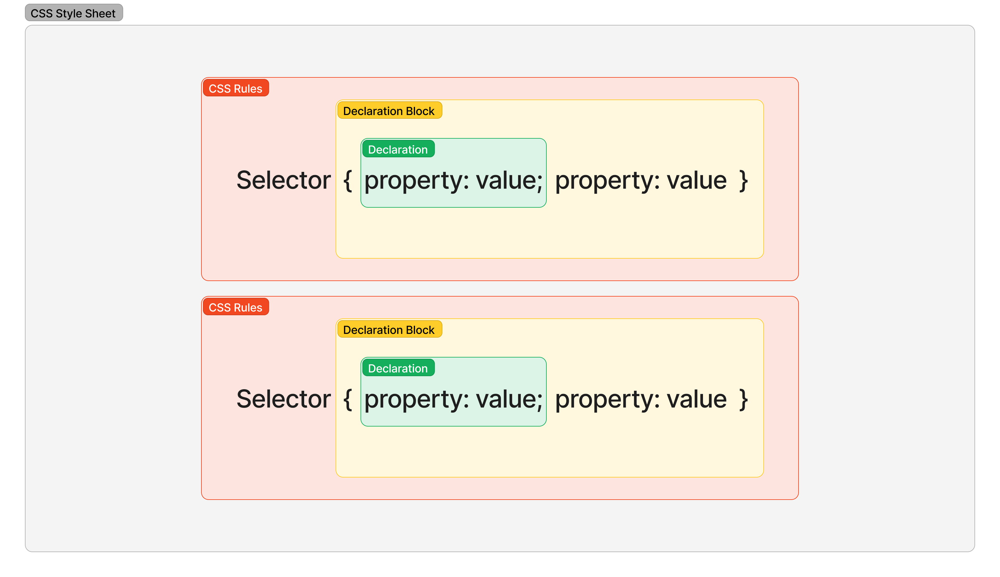

# 4월3주차

## HTML


HTML(HyperText Markup Language는 마크업 언어, HTML 태그를 통해 정보를 구조화



## HTML5에서 추가된 기능

* [ ] 멀티미디어(video, audio) 지원
* [ ] 2차원 그래픽(svg, canvas), 3차원 그래픽(CSS3, WebGL) 지원
* [ ] 서버와의 소켓 통신을 지원(양방향 통신)
* [ ] 하드웨어(camera, sensor) 제어 지원
* [ ] 오프라인 상태에서 동작 지원
* [ ] 시멘틱 태그


## HTML&#x20;

* \<!DOCTYPE html>으로 시작
* \<html>\</html> 사이에 Document 작성
* \<head> 태그 안에 title, 외부 파일 참조, 메타데이터 설정
* \<body> 태그 안에 웹 브라우저에 출력되는 Document 작성
* 태그는 대소문자 구분 X(W3C에서 HTML4에서 소문자를 추천하므로 소문자로 권장)

```html
<!DOCTYPE html>
<html>
  <head>
    <meta charset="utf-8">
    <title>Hello World</title>
  </head>
  <body>
    <h1>Hello World</h1>
    <p>안녕하세요! HTML5</p>
  </body>
</html>
```


## 빈 요소


content를 가질 수 없지만 Attribute만을 가진다.


* br
* hr
* img
* input
* link
* meka


## Attribute


요소(element, tag)의 성질, 특징을 정의하는 명세


* Global Attributes
  * id
  * class
  * hidden
  * lang
  * style
  * tabindex
  * title


## 시멘틱 웹


메타데이터(Metadata)를 부여하여 웹 페이지에 의미와 관련성을 부여


* non sementic element
  * div
  * span
* sementic element
  * form
  * table
  * img
  * HTML5에서 추가된 요소: header, nav, aside, section, article, footer


## HTML Tag

1. 문서 형식 정의(Document Type Definition, DTD)

```html
<!DOCTYPE html>
```


2. HTML

* 모든 HTML 요소의 부모 태그(DTD 제외)
* global attribute 지원(example lang="ko")


3. head

* meta 데이터 포함 요소(title, style, link, script) 정의

```html
<!DOCTYPE html>
<html>
  <head>
    <meta charset="utf-8">
    <meta name="keywords" content="HTML, CSS, XML, XHTML, JavaScript"> <!-- SEO(검색엔진 최적화)를 위해 검색엔진이 사용할 keywords 정의 -->
    <meta name="description" content="Web tutorials on HTML and CSS"> <!-- 웹페이지의 설명 정의 -->
    <meta name="author" content="John Doe"> <!-- 웹페이지의 저자 명시 -->
    <meta http-equiv="refresh" content="30"> <!-- 웹페이지를 30초 마다 Refresh -->
    <title>문서 제목</title> <!-- 문서 제목 -->
    <style> 
      body {
        background-color: black;
      }
    </style> <!-- HTML문서 style -->
    <link rel="stylesheet" href="global.css"> <!-- 외부 리소스 참조(HTML, CSS) -->
    <script>
      document.addEventListener('click', function () {
        alert('javascript call!');
      });
    </script> <!-- client-side javascript 정의 -->
    <script src="main.js"></script> <!-- src Attribute 사용하여 외부 리소스 참조(javascript) -->
  </head>
  <body>
  </body>
</html>
```


4. body

* HTML 문서 내용, meta 데이터 제외한 구성 대부분 요소


5. 제목(Headings)

* 제목(시멘틱 웹) 이외에는 사용하지 않는 것이 좋다

```html
<!DOCTYPE html>
<html>
  <body>
    <h1>heading 1</h1>
    <h2>heading 2</h2>
    <h3>heading 3</h3>
    <h4>heading 4</h4>
    <h5>heading 5</h5>
    <h6>heading 6</h6>
  </body>
</html>
```


6. 글자 형태(Text Formatting)

* bold: `<b><b/>` vs **`<strong></strong>`** (Semantic)
* Italic: `<i><i/>` vs **`<em></em>`** (Semantic)
* _small:_ `<small></small>`
* _highlighted text:_ `<mark></mark>`
* _deleted text:_ `<del></del>`
* inserted text: `<ins></ins>`
* subscripted/superscripted: `<sub></sub>` / `<sup></sup>`


7. 본문

* 단락(Paragraphs): `<p></p>`
* 개행(line break): `<br>`
* 연속적 공백:  `&nbsp;`
* 형식화된(preformatted) text(줄바꿈 공백 등 적용): `<pre></pre>`
* 수평 줄: `<hr>`
* 짧은 인용문(quotation, 인용부호인 큰따옴표 사용): `<q></q>`
* 긴 인용문(들여쓰기): `<blockquote></blockquote>`


8. Hyperlink


하이퍼링크란 한 텍스트에서 다른 텍스트로 건너뛰어 읽을 수 있는 기능


* a(author) 태그
  * target
    * \_self(현재 윈도우에서 오픈), \_black(새로운 윈도우나 탭에서 오픈)
    * \*target ="\_black"에서 보안 취약점(Tabnabbing 피싱 공격: 외부페이지에서 악의적인 페이지로 리다이렉트) -> rel="noopener noreferrer"
  * href: 이동하고자하는 파일의 위치(경로)

| href Value          | example                             |
| ------------------- | ----------------------------------- |
| 절대 URL              | html="https://google.com/home.html" |
| 상대 URL              | href="html/home.html"               |
| Fragment identifier | href="#top" (특정 id 갖는  요소)          |
| Mail                | href="mailto:"                      |
| script              | href="javascript:alert("");"        |


* 디렉터리

1. 루트 디렉터리: 최상위 디렉터리

* Unix: /&#x20;
* Windows: C:\\


2. 홈 디렉터리: 사용자 개발 디렉터리

* Unix: /Users/{계정명}
* Windows: C:\Users\\{계정명}


3. 작업 디렉터리

* ./


4. 부모 디렉터리

* ../


* 파일 경로

1. 절대경로: 루트 디렉터리 기준

* https://google.com/home.html
* /Users/{계정명}/Desktop/profile.jpg
* C:\Users\\{계정명}\Desktop\profile.jpg
* /index.html


2. 상대경로

* ./index.html
* ../dist/main.js
* ../../dist/main.js
* index.html
* html/index.html


9. 목록

* 순서없는 목록: ul\


```html
<!DOCTYPE html>
<html>
  <body>
    <h1>순서없는 목록</h1>
    <ul>
      <li>Coffee</li>
      <li>Tea</li>
      <li>Milk</li>
    </ul>
  </body>
</html>
```

* 순서있는 목록: ol

```html
<!DOCTYPE html>
<html>
  <body>
    <h1>순서있는 목록</h1>
    <ol>
      <li>Coffee</li>
      <li>Tea</li>
      <li>Milk</li>
    </ol>
  </body>
</html>
```

* type: 순서 나타내는 문자 형식 변경

| Value | Description |
| ----- | ----------- |
| 1     | 숫자(default) |
| A     | 대문자 알파벳     |
| a     | 소문자 알파벳     |
| I     | 대문자 로마숫자    |
| i     | 소문자 로마숫자    |

* start: 리스트 시작값 지정
* reversed: 리스트의 순서값을 역으로 표현


10. 테이블

* table: 표를 선언
  * border: 표 테두리 두께 지정
  * rowspan: 셀이 점유하는 행의 수 지정
  * colspan: 셀이 점유하는 열의 수 지정
* tr: 표 내부 행(table row)
* th: 표 내부 제목 셀(table heading)
* td: 표 내부 일반 셀(table data)


11. 이미지

* img 태그 사용
  * src: 파일 경로
  * alt: 파일이 없을 경우 표시되는 문장
  * width: 너비
  * height: 높이


12. 미디어

    1.  오디오

        1. audio 태그 사용: IE8 이하에서 사용 불가\
           \- src: 음악 파일 경로\
           \- preload: 재생 전에 음악 파일을 모두 불러올 것인지\
           \- autoplay: 음악 파일을 자동 재생할 것인지\
           \- loop: 음악을 반복재생할 것인지\
           \- controls: 음악 재생 도구를 표시할 것인지\

        2. source 태그 사용: audio 태그는 웹브라우저 별로 지원하는 파일 형식이 다르다.\
           \- type(생략가능): "audio/mp3" | "audio/wav" | "audio/ogg"

        &#x20;
    2. 비디오
       1. video 태그 사용 : IE8 이하에서 사용 불가 \
          \- src : 동영상 파일 경로\
          \- poster :  동영상 준비 중에 표시될 이미지 파일 경로\
          \- preload :  재생 전에 동영상 파일을 모두 불러 올 것인지 지정\
          \- autoplay :  동영상 파일을 자동의 재생 개시할 것인지 지정\
          \- loop : 동영상을 반복할 것인지 지정\
          \- width: 동영상 너비\
          \- height: 동영상 높이
       2. source 태그 사용: audio 태그는 웹브라우저 별로 지원하는 파일 형식이 다르다.\
          \- type(생략가능): "video/mp4" | "video/webm" | "video/ogv"

    \

13. &#x20;form

* 입력 양식 태그 포함할 수 있다.
  * action: 전송될 URL 지정
  * method: 전달 방식(get/post) 지정

> GET
>
> * URL에 입력 데이터를 쿼리 스트링으로 보내는 방식
> * 데이터 노출로 보안에 문제 가능성
> * 전송할 수 있는 데이터 최대 255자


> POST
>
> * 입력 데이터를 Request Body에 담아 보내는 방식
> * 데이터 노출되지는 않지만 GET에 비해 평균 속도가 느림


14. &#x20;input

* form 태그 내에서 입력 데이터 전송(ajax 쓰면 form 밖에서도 전송 가능)


Ajax(Asynchronous JavaScript and XML)란 자바스크립트를 이용해서 **비동기적(Asynchronous)**으로 서버와 브라우저가 데이터를 교환할 수 있는 통신 방식


* type으로 종류 구분, 서버에 전송되는 값은 key(=name Attribute), value(=value Attribute)

```html
<!DOCTYPE html>
<html>
  <body>
    <h3>button</h3>
    <input type="button" value="Click me" onclick="alert('Hello world!')"> <!-- 버튼 생성 -->
    <hr>

    <h3>checkbox</h3>
    <input type="checkbox" name="fruit1" value="apple" checked> 사과<br> <!-- checkbox 생성 -->
    <input type="checkbox" name="fruit2" value="grape"> 포도<br>
    <input type="checkbox" name="fruit3" value="peach"> 복숭아<br>
    <hr>

    <h3>color</h3>
    <input type="color" name="mycolor"> <!-- 컬러 선택 생성 -->
    <hr>

    <h3>date</h3>
    <input type="date" name="birthday"> <!-- date control (년월일) 생성 -->
    <hr>

    <h3>datetime-local</h3>
    <input type="datetime-local" name="birthdaytime"> <!-- 지역 date & time control (년월일시분초) 생성 --> 
    <hr>

    <h3>email</h3>
    <input type="email" name="useremail"> <!-- 이메일 입력 form 생성. subumit 시 자동 검증 -->
    <hr>

    <h3>file</h3>
    <input type="file" name="myfile"> <!-- 파일 선택 form 생성 -->
    <hr>

    <h3>hidden</h3>
    <input type="hidden" name="country" value="Norway"> <!-- 감추어진 입력 form 생성 -->
    hidden filed는 사용자에 표시되지 않는다.
    <hr>

    <h3>image</h3>
    <input type="image" src="img/img_submit.gif" alt="Submit" width="48" height="48"> <!-- 이미지로 된 submit button 생성 -->
    <hr>

    <h3>month</h3>
    <input type="month" name="birthdaymonth"> <!-- 월 선택 form 생성 -->
    <hr>

    <h3>number</h3>
    <input type="number" name="quantity" min="2" max="10" step="2" value="2"> <!-- 숫자 입력 form 생성 --> 
    <hr>

    <h3>password</h3>
    <input type="password" name="pwd"> <!-- password 입력 form 생성 --> 
    <hr>

    <h3>radio</h3>
    <input type="radio" name="gender" value="male" checked> 남자<br> <!-- radio button 생성 --> 
    <input type="radio" name="gender" value="female"> 여자<br>
    <hr>

    <h3>range</h3>
    <input type="range" name="points" min="0" max="10" step="1" value="5"> <!-- range select form 생성 --> 
    <hr>

    <h3>reset</h3>
    <input type="reset"> <!-- reset button -->
    <hr>

    <h3>search</h3>
    <input type="search" name="googlesearch"> <!-- search input form -->
    <hr>

    <h3>submit</h3>
    <input type="submit" value="Submit"> <!-- submit button -->
    <hr>

    <h3>tel</h3>
    <input type="tel" name="mytel"> <!-- 전화번호 입력 form -->
    <hr>

    <h3>text</h3>
    <input type="text" name="myname"> <!-- 텍스트 입력 form -->
    <hr>

    <h3>time</h3>
    <input type="time" name="mytime"> <!-- 시간 선택 form -->
    <hr>

    <h3>url</h3>
    <input type="url" name="myurl"> <!-- URL 입력 form -->
    <hr>

    <h3>week</h3>
    <input type="week" name="week_year"> <!-- 주 선택 form -->
  </body>
</html>
```


15. select

* 복수개의 리스트에서 복수개의 아이템
* 서버에 전송되는 값은 key(=select요소의 name Attribute), value(=option요소의 value Attribute)


16. textarea

* name
* rows
* cols


17. button

* type은 권장(button, reset, submit)
* IE6, IE7에서는 내부 콘텐츠를 value, 다른 브라우저는 value Attribute 사용

```html
<button type="submit" name="myButton" value="foo">Click me</button>
```


18. fieldset/legend

* 입력된 양식들을 그룹화할 때
* legend는 fieldset 안에 선언


```html
<!DOCTYPE html>
<html>
  <head>
    <meta charset="UTF-8">
  </head>
  <body>
      <fieldset>
        <legend>Login</legend>
        Username <input type="text" name="username">
        Password <input type="text" name="password">
      </fieldset>
  </body>
</html>
```


19. structure

* non-sementic: div, span
* sementic(IE에서 작동하지 않음): header, nav, aside, section, article, footer


div는 block 요소, span은 inline 요소로 차이가 있습니다.



## CSS Syntax


CSS(Cascading Style Sheets)는 HTML 요소의 style을 정의하여 화면에 렌더링하는지 브라우저에게 설명하는 언어(Style Sheet Language)



### HTML과 CSS의 연동

1. Link Tag

```html
<!DOCTYPE html>
<html>
  <head>
      <link rel="stylesheet" href="css/style.css">
  </head>
  <body>
  </body>
</html>
```

2. Embedding&#x20;

```html
<!DOCTYPE html>
<html>
  <head>
    <style>
      h1 { color: red; }
      p  { background: aqua; }
    </style>
  </head>
  <body>
  </body>
</html>
```

3. lnline Style

```html
<!DOCTYPE html>
<html>
  <head>
  </head>
  <body>
    <h1 style="color: red">Hello World</h1>
  </body>
</html>
```


### Reset CSS

> 브라우저 별로 제각각인 디폴트 스타일을 하나의 스타일로 통일시켜 주는 역할

* [Eric Meyer\`s reset css](https://meyerweb.com/eric/tools/css/reset/)
* [opensource(normalize.css)](https://necolas.github.io/normalize.css/)


## CSS Selector

<figure><figcaption></figcaption></figure>

| selector pattern           | description                                  | example                                        |
| -------------------------- | -------------------------------------------- | ---------------------------------------------- |
| \*                         | HTML 모든 요소(head 포함)                          |  \* { property: value }                        |
| tag                        | tag 명 가진 요소                                  |   a{ cproperty: value}                         |
| #id                        | id Attribute 값, 중복 X                         | #id { property: value }                        |
| .class                     | class Attribute 값, 중복O                       | .class { property: value }                     |
| selector\[Attribute]       | 해당 요소의 Attribute를 갖는 모든 요소                   | selector\[Attribute] { property: value }       |
| selector\[Attribute="값"]   | 해당 요소의 Attribute를 갖고 값이 일치하는 모든 요소           | selector\[Attribute="값"] { property: value }   |
| selector\[Attribute\~="값"] | 해당 요소의 Attribute를 갖고 값을 포함(공백으로 분리된)하는 모든 요소 | selector\[Attribute\~="값"] { property: value } |
| selector\[Attribute\|="값"] | 해당 요소의 Attribute를 갖고 값이 일치하거나 "값-"로 시작하는 요소  | selector\[Attribute\|="값"] { property: value } |
| selector\[Attribute^="값"]  | 해당 요소의 Attribute를 갖고 값으로 시작하는 요소             | selector\[Attribute^="값"] { property: value }  |
| selector\[Attribute&="값"]  | 해당 요소의 Attribute를 갖고 값으로 끝나는 요소              | selector\[Attribute&="값"] { property: value }  |
| selector\[Attribute\*="값"] | 해당 요소의 Attribute를 갖고 값을 포함하는 요소              | selector\[Attribute\*="값"] { property: value } |
| selectorA selectorB        | selectorA의 모든 하위 요소 중 selectorB와 일치하는 요소     | selectorA selectorB { property: value }        |
| selectorA > selectorB      | selectorA의 모든 자식 요소 중 selectorB와 일치하는 요소     | selectorA > selectorB { property: value }      |
| selectorA + selectorB      | selectorA 바로 뒤에 위치하는 selectorB               | selectorA + selectorB { property: value }      |
| selectorA \~ selectorB     | selectorA 뒤에 위치하는 selectorB 모든 요소            | selectorA \~ selectorB { property: value }     |


### 가상 클래스 Selector (Pseudo-class Selector)

* CSS 표준에 의해 정의된 패턴을 써야함.
* 한 개의 콜론(:)으로 구분

| selector pattern     | description                                  | example                                        |
| -------------------- | -------------------------------------------- | ---------------------------------------------- |
| :link                | 방문하지 않은 링크일 때                                | selector:link { property: value }              |
| :visited             | 방문한 링크일 때                                    | selector:visited { property: value }           |
| :hover               | 마우스가 올라와 있을 때                                | selector:hover { property: value }             |
| :active              | 클릭된 상태일 때                                    | selector:active { property: value }            |
| :focus               | 포커스가 들어와 있을 때                                | selector:focus { property: value }             |
| :checked             | 체크 상태일 때                                     | selector:checked { property: value }           |
| :enabled             | 사용 가능한 상태일 때                                 | selector:enabled { property: value }           |
| :disabled            | 사용 불가능한 상태일 때                                | selector:disabled { property: value }          |
| :first-child         | 모든 요소 중 첫번째 자식인 요소                           | selector:first-child { property: value }       |
| :last-child          | 모든 요소 중 마지막 자식인 요소                           | selector:last-child { property: value }        |
| :nth-child(n)        | 모든 요소 중 앞에서 n(0부터 시작하는 정수) 번째 자식인 요소         | selector:nth-child(n) { property: value }      |
| :nth-last-child(n)   | 모든 요소 중 뒤에서 n(0부터 시작하는 정수) 번째 자식인 요소         | selector:nth-last-child(n) { property: value } |
| :first-of-type       | 부모 요소의 자식 요소 중 첫번째 등장하는 요소                   | selector:first-of-type { property: value }     |
| :last-of-type        | 부모 요소의 자식 요소 중 마지막 등장하는 요소                   | selector:last-of-type { property: value }      |
| :nth-of-type(n)      | 부모 요소의 자식 요소 중 앞에서 n(0부터 시작하는 정수)번째에 등장하는 요소 | selector:nth-of-type(n) { property: value }    |
| :nth-last-of-type(n) | 부모 요소의 자식 요소 중 뒤에서 n(0부터 시작하는 정수)번째에 등장하는 요소 | selector:nth-of-type(n) { property: value }    |
| :not                 | 해당하지 않는 모든 요소                                | selector:not { property: value }               |
| :valid               | 정합성 검증이 성공한 input 요소 또는 form 요소를 선택          | selector:valid { property: value }             |
| :invalid             | 정합성 검증이 실패한 input 요소 또는 form 요소를 선택          | selector:invalid { property: value }           |


### 가상 요소 Selector (Pseudo-Element Selector)

* CSS 표준에 의해 정의된 패턴을 써야함.
* 두 개의 콜론(::)으로 구분

| selector pattern | description                                  | example                                    |
| ---------------- | -------------------------------------------- | ------------------------------------------ |
| ::first-letter   | 콘텐츠의 첫글자를 선택                                 | selector::first-letter { property: value } |
| ::first-line     | 콘텐츠의 첫줄을 선택, block 요만 적용                     | selector::first-line { property: value }   |
| ::after          | 콘텐츠의 뒤에 위치하는 공간을 선택, content property와 함께 사용 | selecto::after { property: value }         |
| ::before         | 콘텐츠의 앞에 위치하는 공간을 선택, content property와 함께 사용 | selector::before { property: value }       |
| ::selection      | 드래그한 콘텐츠를 선택                                 | selector::selection { property: value }    |


## CSS Property Unit

> Property Unit은 기본적으로는 키워드, 크기 단위, 색상 표현 단위


### 크기 단위

* CSS에서 사용하는 대표적인 크기 단위는 px, em, % (browser font size 기준으로 16px, 1em, 100%)

#### 1. px

* 1px = 화소 1개의 크기(해상도에 따라 상대적임)
* 1/96inch(대부분의 browser)


#### 2. %

* 백분률 단위의 상대 단위(지정된 사이즈(상속된 사이즈나 디폴트 사이즈)에 상대적인 사이즈를 설정)
* 상속에 의해 부모 요소에서 영향 받음


#### 3. em

* 배수 단위로 상대 단위(지정된 사이즈(상속된 사이즈나 디폴트 사이즈)에 상대적인 사이즈를 설정)
* 상속에 의해 부모 요소에서 영향 받음


#### 4. rem

* root(HTML 기준) + em
* Reset CSS로 default size 조절 필요


#### 5. viewport

* IE 8 이하는 지원하지 않으며 IE 9 \~ 11, Edge는 일부 지원
* vw: viewport 너비의 1/100
* vh: viewport 높이의 1/100
* vmin: viewport 너비와 높이 중 작은 것의 1/100
* vmax: viewport 너비와 높이 중 큰 것의 1/100


#### 6. color unit

* keyword
* HEX code
* RGB (Red, Green, Blue)
* RGBA (Red, Green, Blue, Alpha/투명도)
* HSL (Hue/색상, Saturation/채도, Lightness/명도)
* HSLA (Hue/색상, Saturation/채도, Lightness/명도, Alpha/투명도)


## CSS Box Model

> Browser는 Box의 크기, 프로퍼티, 위치를 기준으로 렌더링


* Content: Width, Height
* Padding: Padding 영역의 두께
* Border: 테두리 두께
* Margin: Margin 영역의 두께



배경과 이미지의 영역은 Content + Padding



### Width/ Height

* box-sizing이 **content-box(default)**이면  Content 영역까지
* box-sizing이 **border-box**이면  Content + Padding + Border 영역까지



block 요소의 경우, width는 부모 요소의 100%, height는 콘텐츠의 높이(+ @)가 지정



### Margin/Padding

* Content 영역의 4개의 방향을 지정

```css
/* 4개의 값을 지정할 때(top right bottom left) */
margin: 25px 50px 75px 100px;

/* 3개의 값을 지정할 때(top horizontal bottom) */
margin: 25px 50px 75px; 

/* 2개의 값을 지정할 때(vertical horizontal) */
margin: 25px 50px;

/* 1개의 값을 지정할 때(top = right = bottom = left) */
margin: 25px;
```



max-width는 가로 스크롤바, max-height는 세로 스크롤바



### Border

#### 1. border-style

```css
p.dotted { border-style: dotted; }
p.dashed { border-style: dashed; }
p.solid  { border-style: solid; }
p.double { border-style: double; }
p.groove { border-style: groove; }
p.ridge  { border-style: ridge; }
p.inset  { border-style: inset; }
p.outset { border-style: outset; }
p.none   { border-style: none; }
p.hidden { border-style: hidden; }
p.mix    { border-style: dotted dashed solid double; }
```

#### 2. border-width

* `border-style`과 함께 사용해야 적용됨

#### 3. border-color

* `border-style`과 함께 사용해야 적용됨

#### 4. border-radius

* 타원(x, y의 반지름을 순서대로) 혹은 원을 표현

```css
/* 4개의 값을 따ㄹ 지정할 때 */
border-top-left-radius:     20px;
border-top-right-radius:    20px;
border-bottom-right-radius: 20px;
border-bottom-left-radius:  20px;

/* 2개의 값을 지정할 때(top-left & bottom-right 또는 top-right & bottom-left) */
border-radius: 25px 50px;

/* 1개의 값을 지정할 때 */
border-radius: 25px;

/* 단일 값 타원(x, y 반지름) */
border-bottom-left-radius: 20px 25px;
```


#### 5. border

* `border-width`, `border-style`, `border-color` 한번에 설정 위한 shorthand syntax

```
border: border-width border-style border-color
```

### Box-Sizing

* box-sizing이 **content-box(default)**이면  Content 영역까지 Width, Height
* box-sizing이 **border-box**이면  Content + Padding + Border 영역까지 Width, Height


## CSS Display, Visibility, Opacity Properties


### Display

* 요소의 layout 정의
* block, inline, inline-block, none, flex
* HTML 요소는 block 또는 inline 특성


display 프로퍼티는 상속되지 않는다.



#### 1. block

* 항상 새로운 라인에서 시작
* defulat 값은 width(100%, 화면 전체 크기), height(auto)
* width, height, margin, padding 프로퍼티 지정 가능
* block 안에 inline 포함 가능
* 요소 예시
  * div
  * h1 \~ h6
  * p
  * ol
  * ul
  * li
  * hr
  * table
  * form


#### 2. inline

* 줄을 바꾸지 않고 다른 요소와 함께 한 행에 위치
* widht(content 너비)
* width, height, margin-top, margin-bottom 프로퍼티를 지정할 수 없다.\
  **->** **상, 하 여백은 line-height로 지정**
* inline 레벨 요소 뒤에 공백(엔터, 스페이스 등)이 있는 경우 4px 공백 생김.
* inline 안에 block 포함 불가
* 요소 예시
  * span
  * a
  * strong
  * img
  * br
  * input
  * select
  * textarea
  * button


#### 3. inline-block

* inline 요소 특징 가짐
* width, height, margin, padding 프로퍼티를 모두 정의 가능(block 특징)
* [inline 뒤에 공백 처리](https://css-tricks.com/fighting-the-space-between-inline-block-elements/)


### Visibility

* 요소의 렌더링 여부를 결정


#### 1. visible

* (defualt 값) 요소 렌더링


#### 2. hidden

* 요소의 공간은 남아있고 렌더링만 안되도록 함.


#### 3. collapse

* table 요소에서 사용, 요소의 공간은 남아있고 행이나 열을 렌더링 안되도록 함.


### Opacity

* 요소의 투명도를 정의
* 0.0은 투명 \~ 1.0은 불투명


## CSS Background Property


### background-image property

* 배경 이미지 지정

```css
div {
    background-image: url(${url});
}
```


### background-repeat property <a href="#2-background-repeat" id="2-background-repeat"></a>

* 배경이미지 수직, 수평 또는 모두의 반복을 지정

```css
.bg-repeat-x {
    background-image: url(${url});
    background-repeat: repeat-x; /* 배경이미지를 x축으로 반복 */
}

.bg-repeat-y {
    background-image: url(${url});
    background-repeat: repeat-y; /* 배경이미지를 y축으로 반복 */
}

.bg-repeat {
    background-image: url(${url});
    background-repeat: repeat; /* 배경이미지를 반복 */
}

.bg-repeat-no {
    background-image: url(${url});
    background-repeat: no-repeat; /* 배경이미지를 반복 하지 않음 */
}

.bg-repeat-images {
    background-image: url(${url}), url(${url}); /* 먼저 설정된 이미지가 전면 출력 */
    background-repeat: no-repeat repeat; /* 첫 번째는 반복하지않고 두번째는 반복 */
}
```


### background-size property

```css
.bg {
  background-size: 700px 500px; /* width: 700px, height: 500px */
  background-size: 700px; /* width: 700px, height: auto */
}

.bg {
  background-size: cover; /* width, height 중 큰 값에 맞춘다(가득 차도록) */
}

.bg {
  background-size: contain; /* 배경이미지의 크기 비율을 유지한 상태로 width, height 중 큰 값에 맞춤 */
}

.bg {
  background-size: 700px 500px;
}
```


### background-attachment property

* 화면이 스크롤될 때 배경이 스크롤되지 않도록 막으려면 `fixed` 키워드 사용


### background-position property

* x. y좌표 값(%, px) 또는 `top`, `bottom`, `left`, `right`, `center` 키워드 사용


### background-color property

* 색상값 또는 `transparent` 키워드 사용


### background-shorthand

```css
.bg {
    background: color || image || repeat || attachment || position
}
```


## Programming

* 프로그래밍 언어 -> 컴파일러(compiler) 혹은 인터프리터(interpreter) -> 기계어


## Javascript와 ECMAScript&#x20;

* ECMAScript - 자바스크립트의 표준 명세인 ECMA-262

| 버전                  | 출시연도 | 특징                                                                                                                                      |
| ------------------- | ---- | --------------------------------------------------------------------------------------------------------------------------------------- |
| ES5                 | 2009 | HTML5와 함께 출현한 표준안. JSON, strict mode, 접근자 프로퍼티(getter, setter), 향상된 배열 조작 기능(forEach, map, filter, reduce, some, every)                 |
| ES6(ECMAScript2015) | 2015 | let, const, class, 화살표 함수, 템플릿 리터럴, 디스트럭처링 할당, spread 문법, rest 파라미터, Symbol, Promise, Map/Set, iterator/generator, module import/export |
| ES7(ECMAScript2016) | 2016 | 지수(\*\*) 연산자, Array.prototype.includes, String.prototype.includes                                                                       |
| ES8(ECMAScript2017) | 2017 | async/await, Object 정적 메소드(Object.values, Object.entries, Object.getOwnPropertyDescriptors)                                             |
| ES9(ECMAScript2018) | 2018 | [Object Rest/Spread 프로퍼티](https://github.com/tc39/proposal-object-rest-spread)                                                          |


* 역사

1. 서버로부터 완전한 HTML을 전송 받아 웹 페이지 전체를 렌더링하는 방식으로 동작
2. 서버와 브라우저가 데이터를 교환할 수 있는 통신 기능인 Ajax(Asynchronous JavaScript and XML)가 XMLHttpRequest이라는 이름으로 등장
3. 구글 V8 자바스크립트 엔진 등장


* ES6 지원 현황

1. Node.js v4이전, 구형 브라우저, IE에서는 `babel`과 같은 트랜스파일러 사용해서 ES5이하로 다운그레이드
2. import/export는 대부분의 브라우저가 지원하지않음 -> `webpack`과 같은 모듈 번들러 사용해야 함.


## 출처

* [https://poiemaweb.com/](https://poiemaweb.com/)
* [https://developer.mozilla.org/ko/docs/Web/API](https://developer.mozilla.org/ko/docs/Web/API)
* [https://kangax.github.io/compat-table/es6/](https://kangax.github.io/compat-table/es6/)
